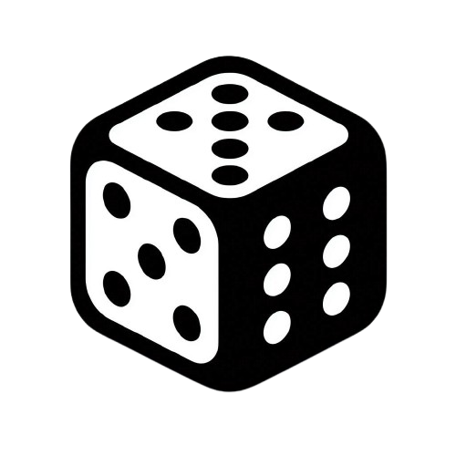
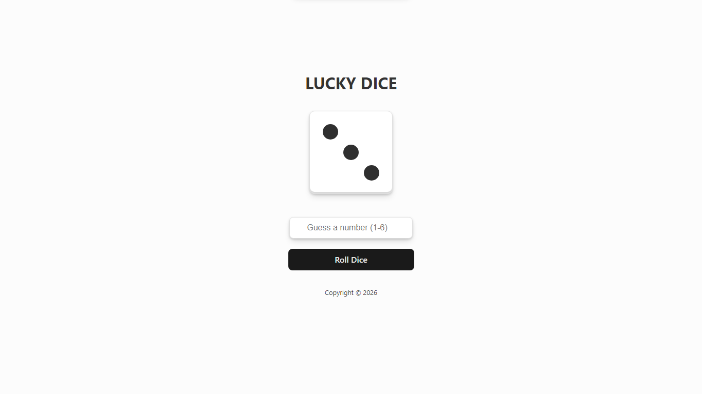
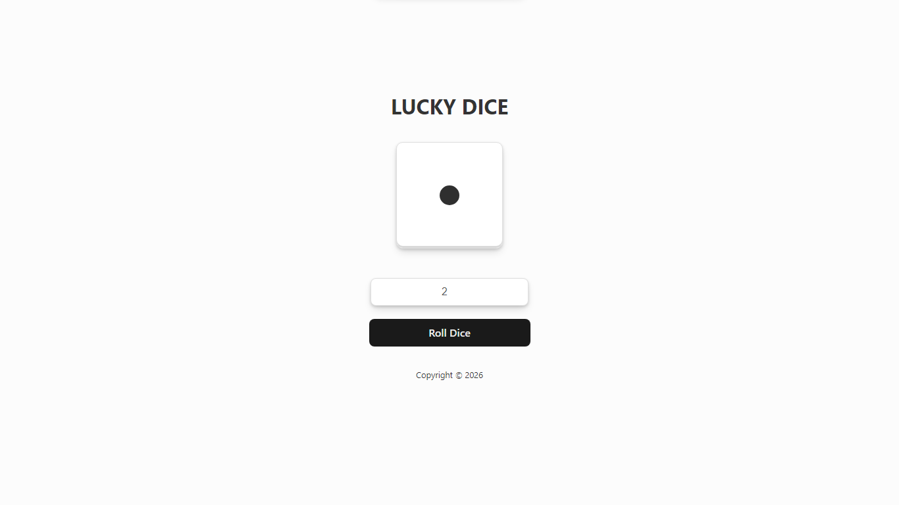
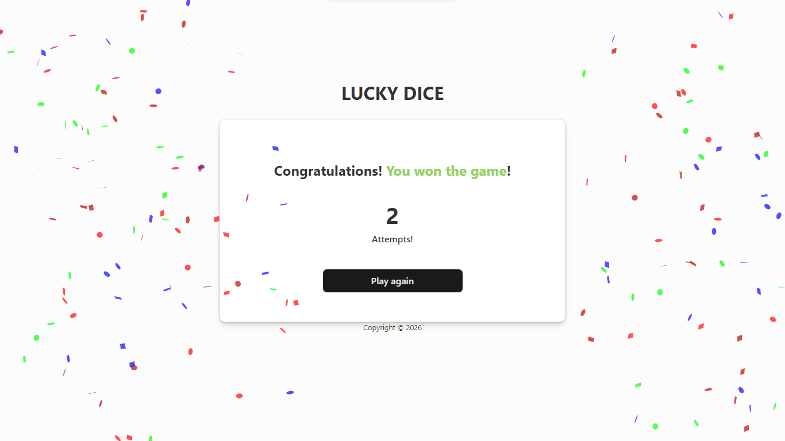

# LUCKY DICE

## Introduction

The "Lucky Dice" project is a simple guessing game where the user tries to guess the number that will be rolled on a dice. The game was developed using React and TypeScript, featuring a user-friendly interface and animations to enhance the user experience.

<p align="center">
  
</p>

## Initial Design and Abstraction

The design of the game was conceived to be intuitive and visually appealing. The main interface contains a dice, a field for the user to enter their guess, and a button to roll the dice. When the user guesses correctly, a confetti animation is displayed.

<p align="center">
  
</p>

## Site Presentation

### Initial State
In the initial state, the user sees the dice, the input field for the guess, and the button to roll the dice.

<p align="center">
  
</p>

### Rolling State
When the dice is rolling, the input field and the button are disabled to prevent multiple entries.

<p align="center">
  
</p>

### Winning State
If the user guesses correctly, a confetti animation is displayed and a victory message appears.

<p align="center">
  
</p>

### Losing State
If the user guesses incorrectly, an error message is displayed and the number of attempts is incremented.

<p align="center">
  
</p>

## Main Code

### Game.tsx
```tsx
import { useState } from 'react';
import Dice from '../Dice/Dice';
import './Game.css';
import { launchConfetti } from '../../utils/confettiUtil';

interface gameProps {
  setAttempt: (n: number) => void;
  onWin: () => void;
  attempt: number;
}

const Game: React.FC<gameProps> = ({ setAttempt, onWin, attempt }) => {
  const [roll, setRoll] = useState<number>(0);
  const [userGuess, setUserGuess] = useState<number | ''>('');
  const [message, setMessage] = useState<string>('');
  const [isRolling, setIsRolling] = useState<boolean>(false);

  const handleRoll = () => {
    if (userGuess === '') {
      setMessage('Please choose a number between 1 and 6!');
      return;
    }

    if (userGuess < 1 || userGuess > 6) {
      setMessage('The number must be between 1 and 6!');
      return;
    }

    setIsRolling(true);
    setMessage('');

    const rollAnimation = setInterval(() => {
      setRoll(Math.floor(Math.random() * 6) + 1);
    }, 150);

    setTimeout(() => {
      clearInterval(rollAnimation);
      const newRoll = Math.floor(Math.random() * 6) + 1;
      setRoll(newRoll);

      if (userGuess === newRoll) {
        setMessage('');
        launchConfetti();
        onWin();
      } else {
        setAttempt(attempt + 1);
        setMessage('');
      }

      setIsRolling(false);
      setUserGuess('');
    }, 2000);
  };

  return (
    <div id='game'>
      <Dice roll={roll} userGuess={userGuess} setUserGuess={setUserGuess} handleRoll={handleRoll} isRolling={isRolling} />
      {message && <div className="message">{message}</div>}
    </div>
  );
};

export default Game;
```

### Dice.tsx
```tsx
import './Dice.css';

interface DiceProps {
    roll: number;
    userGuess: number | '';
    setUserGuess: (n: number | '') => void;
    handleRoll: () => void;
    isRolling: boolean;
}

const Dice: React.FC<DiceProps> = ({ roll, userGuess, setUserGuess, handleRoll, isRolling }) => {
    const getActiveBalls = (number: number) => {
        switch (number) {
            case 1: return [4];
            case 2: return [1, 7];
            case 3: return [1, 4, 7];
            case 4: return [1, 3, 5, 7];
            case 5: return [1, 3, 4, 5, 7];
            case 6: return [1, 2, 3, 5, 6, 7];
            default: return [4];
        }
    };

    const activeBalls = getActiveBalls(roll);

    return (
        <div id='dice'>
            <div id='dice-container'>
                <div id="colum-1">
                    <div className={`ball ${activeBalls.includes(1) ? 'ball-active' : 'ball-disable'}`}></div>
                    <div className={`ball ${activeBalls.includes(2) ? 'ball-active' : 'ball-disable'}`}></div>
                    <div className={`ball ${activeBalls.includes(3) ? 'ball-active' : 'ball-disable'}`}></div>
                </div>
                <div id="colum-2">
                    <div></div>
                    <div className={`ball ${activeBalls.includes(4) ? 'ball-active' : 'ball-disable'}`}></div>
                    <div></div>
                </div>
                <div id="colum-3">
                    <div className={`ball ${activeBalls.includes(5) ? 'ball-active' : 'ball-disable'}`}></div>
                    <div className={`ball ${activeBalls.includes(6) ? 'ball-active' : 'ball-disable'}`}></div>
                    <div className={`ball ${activeBalls.includes(7) ? 'ball-active' : 'ball-disable'}`}></div>
                </div>
            </div>
            <div className='buttons'>
                <input
                    type="number"
                    value={userGuess}
                    onChange={(e) => setUserGuess(Number(e.target.value))}
                    placeholder="Guess a number (1-6)"
                    min="1"
                    max="6"
                    disabled={isRolling}
                    className='input'
                />
                <button onClick={handleRoll} disabled={isRolling}>Roll Dice</button>
            </div>
        </div>
    );
};

export default Dice;
```

### App.tsx
```tsx
import { useState } from 'react';
import { Card } from '../components/Card/Card';
import Game from '../components/Game/Game';
import './App.css';

function App() {
  const [attempt, setAttempt] = useState<number>(0);
  const [showCard, setShowCard] = useState<boolean>(false);

  const handleWin = () => {
    setShowCard(true);
  };

  const handleRestart = () => {
    setAttempt(0);
    setShowCard(false);
  };

  return (
    <main id='container'>
      <header id='container-title'>
        <h1>LUCKY DICE</h1>
      </header>
      <section id='container-game'>
        <Game setAttempt={setAttempt} onWin={handleWin} attempt={attempt} />
      </section>
      {showCard && (
        <Card attempt={attempt} onRestart={handleRestart} />
      )}
      <footer id='container-copy'>
        <p>Copyright © 2026</p>
      </footer>
    </main>
  );
}

export default App;
```

## References
- [React Documentation](https://reactjs.org/docs/getting-started.html)
- [TypeScript Documentation](https://www.typescriptlang.org/docs/)
- [Canvas Confetti Documentation](https://www.npmjs.com/package/canvas-confetti)

## Contact
For more information, please contact via email: [vsandre40@gmail.com]
