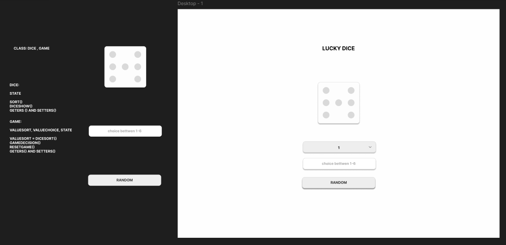

# LUCKY DICE

## Introduction

The "Lucky Dice" project is a simple guessing game where the user tries to guess the number that will be rolled on a dice. The game was developed using React and TypeScript, featuring a user-friendly interface and animations to enhance the user experience.

<p align="center">
  
</p>

## Initial Design and Abstraction

The design of the game was conceived to be intuitive and visually appealing. The main interface contains a dice, a field for the user to enter their guess, and a button to roll the dice. When the user guesses correctly, a confetti animation is displayed.

<p align="center">
  
</p>

## Site Presentation

### Initial State
In the initial state, the user sees the dice, the input field for the guess, and the button to roll the dice.

<p align="center">
  
</p>

### Rolling State
When the dice is rolling, the input field and the button are disabled to prevent multiple entries.

<p align="center">
  
</p>

### Winning State
If the user guesses correctly, a confetti animation is displayed and a victory message appears.

<p align="center">
  
</p>

### Losing State
If the user guesses incorrectly, an error message is displayed and the number of attempts is incremented.

<p align="center">
  
</p>

## Main Code

### Game.tsx
```tsx
import { useState } from 'react';
import Dice from '../Dice/Dice';
import './Game.css';
import { launchConfetti } from '../../utils/confettiUtil';

interface gameProps {
  setAttempt: (n: number) => void;
  onWin: () => void;
  attempt: number;
}

const Game: React.FC<gameProps> = ({ setAttempt, onWin, attempt }) => {
  const [roll, setRoll] = useState<number>(0);
  const [userGuess, setUserGuess] = useState<number | ''>('');
  const [message, setMessage] = useState<string>('');
  const [isRolling, setIsRolling] = useState<boolean>(false);

  const handleRoll = () => {
    if (userGuess === '') {
      setMessage('Please choose a number between 1 and 6!');
      return;
    }

    if (userGuess < 1 || userGuess > 6) {
      setMessage('The number must be between 1 and 6!');
      return;
    }

    setIsRolling(true);
    setMessage('');

    const rollAnimation = setInterval(() => {
      setRoll(Math.floor(Math.random() * 6) + 1);
    }, 150);

    setTimeout(() => {
      clearInterval(rollAnimation);
      const newRoll = Math.floor(Math.random() * 6) + 1;
      setRoll(newRoll);

      if (userGuess === newRoll) {
        setMessage('');
        launchConfetti();
        onWin();
      } else {
        setAttempt(attempt + 1);
        setMessage('');
      }

      setIsRolling(false);
      setUserGuess('');
    }, 2000);
  };

  return (
    <div id='game'>
      <Dice roll={roll} userGuess={userGuess} setUserGuess={setUserGuess} handleRoll={handleRoll} isRolling={isRolling} />
      {message && <div className="message">{message}</div>}
    </div>
  );
};

export default Game;